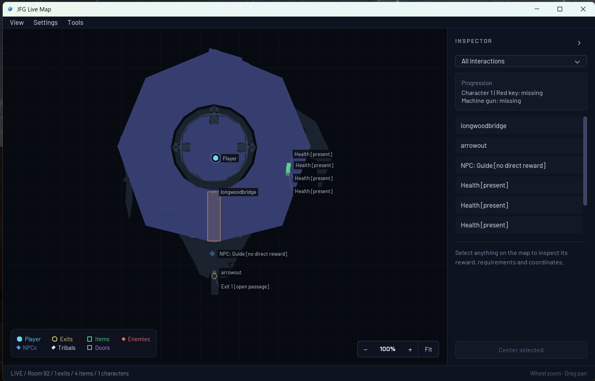

# Jet Force Gemini Recomp

A native PC recompilation of Jet Force Gemini, now available as the
**v1.0 release for Windows x64**. Supply your own supported North American
ROM and build the game locally using the launcher or command-line tools.

**Campaign status: fully playable from start to finish**
through maintainer playtesting.

[Get started](docs/getting-started.md) ·
[Known issues](docs/known-issues.md) ·
[Report a problem](docs/playtesting.md) ·
[Contribute](CONTRIBUTING.md)

## Current release: v1.0

**v1.0 is live.** Get started with the
[released launcher](https://github.com/TK22-26/JetForceGemini-Recomp/releases).

This release includes graphics/audio timing fixes, corrected particle textures,
longer input recordings, live volume/mute controls, player-shadow correction,
sound-player recovery, and optional live map and inventory tools.

The Navigation mod combines supported walking, jumps and NPC interactions;
it remains experimental and does not establish autonomous campaign completion.
HD cosmetic variants stay in independently maintained community branches.

## What works

- Full campaign completion, verified through maintainer playtesting.
- Optional live map and live inventory tracking in a custom companion interface.
- Native rendering and audio.
- Keyboard controls and configurable Xbox/XInput controllers.
- Verified saving and loading, with a launcher for setup and subsequent launches.

Original-console accuracy remains under validation.
Playtesting continues across more PCs, controllers, and gameplay.
See [recent gameplay fixes](docs/development/boot-gameplay-fix.md) and
[development progress](docs/dashboard.md) for details.

## Campaign playtest progress

**Campaign status: fully playable from start to finish**
through maintainer playtesting.

The verification run used optional infinite-health and enemy auto-kill testing
mods, plus a testing save with all Tribals unlocked. Saving and loading are
also verified.

## Live map and inventory

Optional companion tools provide a custom interface for exploring the game
and tracking your progress:

- **Live map:** see your position, room exits, items, NPCs, enemies, Tribals,
  and doors. Select an object to inspect its requirements and rewards; zoom,
  pan, or fit the map to the current room.
- **Live inventory:** track weapons, keys, quest items, and shared ship parts.
  View Juno, Vela, or Lupus, or follow the active character automatically.

*Live map in the custom companion interface.*

The inventory's game icons are extracted locally from each player's own ROM;
those artwork files are not bundled with the project or launcher. The interface
is custom project code. Game content remains the property of its respective
owners.

See the [launcher and live tools guide](docs/development/launcher.md) for details.

## Getting started

Start with the [getting started guide](docs/getting-started.md) for requirements,
downloads, and setup. You need a supported US big-endian `.z64` ROM;
the project does not provide ROMs or game assets.

The [released launcher](https://github.com/TK22-26/JetForceGemini-Recomp/releases)
builds its own pinned source revision. The `main` branch can contain newer
fixes; the guide explains both installation paths. Windows 10 setup has
[reported issues](docs/known-issues.md#windows-10-setup) that are still open.

## Help by playtesting

Play normally and report problems: crashes, freezes, progression blockers,
incorrect controls, graphics or audio, and save/load failures. Check
[known issues](docs/known-issues.md) first and attach the launcher's support
ZIP when available. Successful sessions do not need a report.

See [playtesting and reporting](docs/playtesting.md). If you want to contribute
code, [CONTRIBUTING.md](CONTRIBUTING.md) explains the pull request workflow.

## Future additions

The goal is a complete, faithful PC version of Jet Force Gemini with optional
modern enhancements. Planned work and remaining validation include:

- **Original local multiplayer and optional content:** broader coverage of the
  modes and activities beyond the main campaign.
- **Ultrawide support:** wider aspect ratios with correct gameplay presentation,
  menus, and HUD layout.
- **Higher frame-rate presentation:** smoother visuals while preserving the
  original gameplay timing.
- **Mod support:** documented interfaces and tools for community modifications.
- **A more polished PC experience:** smoother setup, broader controller coverage,
  and better crash and freeze diagnostics.

Compatibility and stability come first. These are development goals; release
dates have not been set.

## Build and development status

- [Build status and CI runs](https://github.com/TK22-26/JetForceGemini-Recomp/actions/workflows/ci.yml)
- [Development progress](docs/dashboard.md)
- [Build the playable game from your ROM](docs/development/rom-bootstrap.md)
- [Build and test the project source](docs/development/setup.md)
- [Documentation index](docs/README.md) and [project roadmap](docs/planning/JFG_RECOMP_MASTER_PLAN.md)

CI checks source, tools, and tests without a ROM. A passing build does not
establish that every level or gameplay feature works.

## License

Original project code and documentation use the [MIT License](LICENSE).
Dependencies retain their [third-party notices](THIRD_PARTY_NOTICES.md).
Jet Force Gemini game content and trademarks belong to their respective owners.
